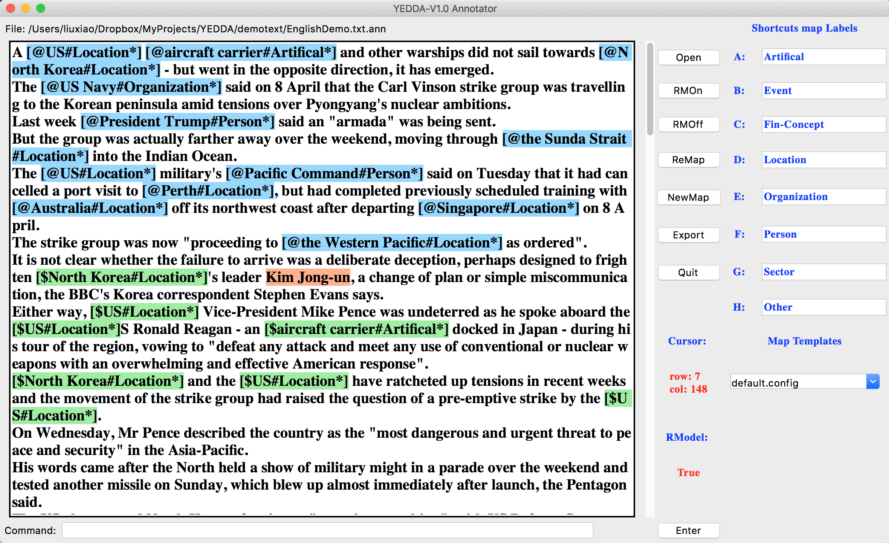
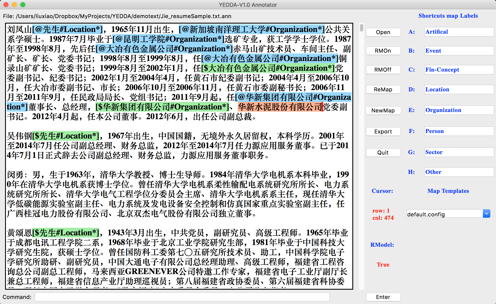
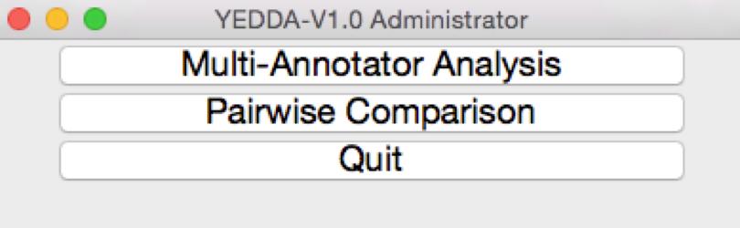
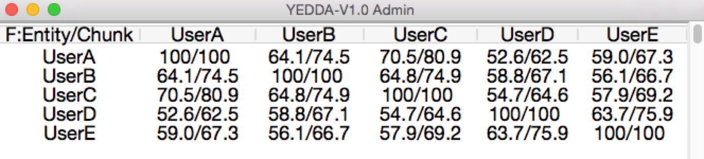
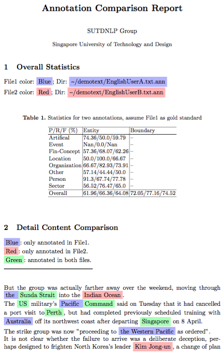
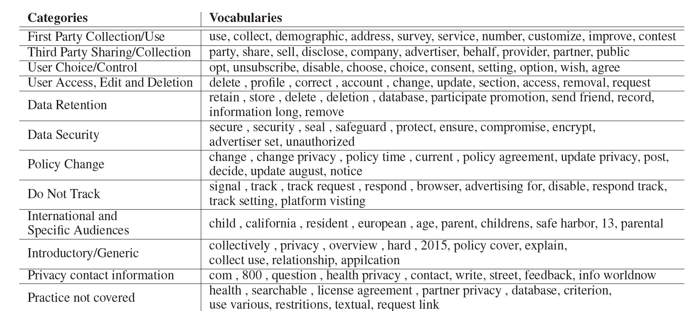

 

--------------------------------------------------------------------------------

YEDDA: A Lightweight Collaborative Text Span Annotation Tool
====

About:
====
YEDDA (the previous SUTDAnnotator) is developed for annotating chunk/entity/event on text (almost all languages including English, Chinese), symbol and even emoji. It supports shortcut annotation which is extremely efficient to annotate text by hand. The user only need to select text span and press shortcut key, the span will be annotated automatically. It also support command annotation model which annotates multiple entities in batch and support export annotated text into sequence text. Besides, intelligent recommendation and adminstrator analysis is also included in updated version. It is compatiable with all mainstream operating systems includings Windows, Linux and MacOS. 

For more details, please refer to [our paper (ACL2018:demo, best demo nomination)](https://arxiv.org/pdf/1711.03759.pdf).

This GUI annotation tool is developed with tkinter package in Python. 

System required: Python 2.7

Author: [Jie Yang](https://jiesutd.github.io), Phd Candidate of SUTD.

Interface:
====
It provides both annotator interface for efficient annotatation and admin interface for result analysis.
* Annotator Interface:
 
 
* Administrator Interface:
 

Use as an annotator ?
====
* Start the interface: run `python YEDDA_Annotator.py`
* 运行`python YEDDA_Annotator.py`开始界面
* Select a shortcut map from `./configs/` in the right bottom drop-down list
* 右下角选择标签的config文件(我已经改好没必要修改)
* Configure your shortcut map in the right side of annotation interface, you can leave other labels empty if the shortcut number is enough. For example: `a: Action; b: Loc; c: Cont`
* 配置标签 （我已经改好了）
* Click the `ReMap` button to overwrite and store the map setting, or click the `NewMap` button to store the map setting in a new file under `./configs/`
* 可以修改标签，不要乱改，不要按ReMap，标注用不到
* Click `Open` button and select your input file. (You may set your file name ended with .txt or .ann if possible)
* 打开txt文件，我们需要标注的文件在document文件夹里
* 打开open选择文件

This tool supports two ways of annotation (annotated text format `[@the text span＃Location*]`):
* Shortcut Key Annotation: select the text and press the corresponding shortcut (i.e. `c` for label `Cont`).
* Command Line Annotation: type the code at command entry (at the bottom of the annotation interface). For example, type `2c3b1a` end with `<Enter>`, it will annotate the following `2` character as type `c: Cont`, the following `3` character as type `b: Loc`, then the following `1` character as  `a: Action`.

<b>** 打开文件后按RMOff，选中需要标注的句子，按对应的快捷键就行（abcdefghijk），记的切换成英文输入法。文件同步保存。标注好之后 按`Export`导出 **</b>

Intelligent recommendation:
* Intelligent recommendation is enabled or disabled by the button `RMOn` and `RMOff`, respectively.
* If recommendation model is enabled, system will recommend entities based on the annotated text. Recommendation span is formatted as  `[$the text span＃Location*]`in green color. (Notice the difference of annotated and recommended span, the former starts with `[@` while the later starts with `[$`)

The annotated results will be stored synchronously. Annotated file is located at the same directory with origin file with the name of ***"origin name + .ann"***
Please also note that the shortcut map can be switched seamlessly in the right bottom drop-down list

Use as an administrator ?
====
YEDDA provides a simple interface for administartor to evaluate and analyze annotation quality among multiple annotators. After collected multiple annotated `*.ann` files from multiple annotators (annotated on same plain text), YEDDA can give two toolkits to monitor the annotation quality: multi-annotator analysis and pairwise annotators comparison.
* Start the interface: run `python YEDDA_Admin.py`
* Multi-Annotator Analysis: press button `Multi-Annotator Analysis` and select multiple annotated `*.ann` files, it will give f-measure matrix among all annotators. The result matrix is shown below:

 
* Pairwise Annotators Comparison: press button `Pairwise Comparison` and select two annotated `*.ann` files, it will generate a specific comparison report (in `.tex` format, can be compiled as `.pdf` file). The demo pdf file is shown below:

Important features:比较难用
=====
1. Type `ctrl + z` will undo  the most recent modification
2. Put cursor within an entity span, press shortcut key (e.g. `x`) to update label (binded with `x`) of the entity where cursor is belonging. (`q` for remove the label)
3. Selected the annotated text, such as `[@美国＃Location*]`, then press `q`, the annotated text will be recoverd to unannotate format (i.e. "美国").
4. Change label directly, select entity content or put cursor inside the entity span (such as `[@美国＃Location*]`), then press `x`, the annotated text will change to new label mapped with shortcut `x` (e.g. `[@美国#Organization*]`).
5. Confirm or remove recommended entity: put cursor inside of the entity span and press `y` (yes) or `q` (quit).
6. In the command entry, just type `Enter` without any command, the cursor in text will move to the head of next line. (You can monitor this through "Cursor").
7. The "Cursor" shows the current cursor position in text widget, with `row` and `col` represent the row and column number, respectively.
8. `Export` button will export the ***".ann"*** file as a identity name with ***".anns"*** in the same directory. The exported file list the content in sequence format. In the source code, there is a flag `self.seged` which controls the exported bahaviour. If your sentences are consist of words seperated with space (such as segmentated Chinese and English), then you may set it `True`, otherwise set it as `False` (for sentences which are consist of characters without space, such as unsegmentated Chinese text). Besides, another flag `self.tagScheme` controls the exporting format, the exported ***".anns"*** will use the `BMES` format if this flag is set to `"BMES"`, otherwise the exported file is formatted as `"BIO".`

1. 普通的撤回，只能撤回一次。
2. 选中后按q，移除标签
3. 选中之后直接按快捷键可以修改标签

标签解释：
====
* Collect personal information 
收集个人数据，个人数据指的是能够识别个人身份的数据，例如身份证号，IP地址，收集多种信息时，如果收集的信息中有提到个人信息的，则标为这个标签
When you play one of our games, DianDian collects and stores certain personal information and non-personal information that you provide directly
we will collect any information that you have agreed to make available to Hongarden Limited through such account, which may include: (1) your first and last name, (2) your user ID/URL, (3) your profile picture, (4) your list of friends, (5) your email address, and/or (6) your birthday.
* Not collect personal information (Collect non-personal information)
作为上一个的标签的负样本，有一些句子只差了一两个单词，但使句子的意义恰好相反
We do not knowingly collect personally identifiable information.
We may collect non-personal information about you through our Service.
* Data retention period
数据存储期限
RETENTION PERIOD OF YOUR PERSONAL INFORMATION
We will also keep it for longer if we cannot delete it for legal or regulatory reasons.
* The purposes of the processing 
处理个人数据的目的，这里是处理的目的，有时候提到的是收集的目的，语义上有一点区别。
We may use and process your Personal Information for one of the following purposes: 
The contact details of the controller 
数据控制方的联系方式，就是指收集数据的公司的联系方式
In case you have any questions with regard to this Privacy Policy, please, contact us via email at support@swagmasha.com,
The contact details of the data protection officer
数据保护官的联系方式，一般都会出现专有名词 “data protection officer”
You may contact Tastypill’s Data Protection Officer at dataprotection@tastypill.com or the address below for further information.
Access personal data 
访问个人数据的权利
You have the right to access your Personal Information.
Rectification or erasure of personal data 
擦除或更改个人数据的权利，提到擦除或更改个人数据的都是此标签。只提到访问的不算此标签
Right of rectification: if the data held is inaccurate, you have the right to have it corrected.
Right to erasure: you have the right to have your data deleted in certain circumstances.
Restriction of processing 
限制处理个人数据的权利
Right to restrict processing: in limited circumstances, you have the right to request that processing is stopped but the data retained.
Object to processing 
拒绝处理个人数据的权利
Right to object: in certain circumstances (including where data is processed on he basis of legitimate interests or for the purposes of marketing) you may object to that processing.
Data portability 
数据携带权，指用户是否能获得一份自己数据的拷贝
Right to data portability: you can request a copy of your data in a machine-readable form that can be transferred to another provider.
RIGHT TO RECEIVE A COPY OF YOUR PERSONAL INFORMATION
Lodge a complaint 
向监管机构申诉的权利
If you wish to make a complaint over the processing of your personal data, you have the right to lodge a complaint to the relevant supervisory authority.

下面是label 相应参考关键词(有些词不太准，帮助理解)
====

label与例子
====

##### First Party Collection/Use:
* collects information from our users at several different points on our Web site.
* We request information from the user on our order form.
* we use clear gifs in our HTML-based emails
* our site requests information from users

##### Third Party Sharing/Collection:
* If you do not want to share your PIN, do not provide it.
* third parties such as advertisers and business partners
* share user information with
* The ads appearing on MediaNews Web sites are delivered to you by Yahoo! and DoubleClick, our third party web advertising company's.

##### User Choice/Control:
* our order form has an 'opt-out' mechanism
* Please see the Choice and Opt-out sections
* option to not receive these types of communications
* may opt-out of receiving these communications by replying to unsubscribe in the subject line in the email.

##### User Access, Edit, & Deletion:
* You may also access, correct or change the personal information in your community profile(s) on SparkNotes.com at any time, except to change your username. To review or modify your profile information, log in to SparkNotes.com.
* right to request a copy of the personal information that we hold about

##### Data Retention:
* (data that is generated on our web server and stored on your computer) are deleted when the browser window is closed.
* Log files are typically deleted from our servers after 90 days.
* MediaNews will retain this information only to provide the forwarding services.
##### Data Security:
* SECURITY MediaNews uses procedures to safeguard and help prevent unauthorized access to the information collected on the MediaNews Web sites. Although such protective measures have been put in place, MediaNews cannot ensure that the information collected will never be disclosed in a manner inconsistent with this Privacy Policy.
* Sometimes, MediaNews uses agents or contractors to provide services that support the internal operations of the site, such as helping us conduct a sweepstakes or sending prizes to winners. In these cases, MediaNews requires the agent or contractor to maintain the confidentiality, security and integrity of the information and limit use to the specific services they are performing on our behalf.
* will have access to your personal information as necessary to perform their functions, but they may not share that information with any other third party.

##### Policy Change
* If we decide to change our privacy policy
* MediaNews may change this privacy policy from time to time. The revised policy will be posted on the MediaNews Web site. Please check this page periodically for changes.
* This Policy was last changed on October 24, 2014

##### Do Not track
* Effect of Tracking Requests. Hearst does not act on Do Not Track requests from your browser because, this way, we are able to personalize your experience on our sites and tailor content to your interests.
* Tracking Requests. Hearst does not act on Do Not Track requests from your browser. For more information click here
* the Services currently do not take action in response to these signals.

##### International & Specific Audiences:
* Barnes & Noble complies with the U.S. - E.U. Safe Harbor framework
* California Civil Code Section 1798.83 permits California residents to request a notice from us describing which categories of personal information we have shared with third parties or corporate affiliates for those third parties or corporate affiliates' direct marketing purposes within the last calendar year, and the name and address of such parties. If you are a California resident and would like a copy of this notice, please send an email to privacy@barnesandnoble.com with \"California Privacy Rights Request\" in the subject line.
* 

##### Introductory/Generic
* This privacy statement covers the site new.www.redorbit.com. Because this Web site wants to demonstrate its commitment to our users' privacy, it has agreed to disclose its information practices. What personally identifiable information RedOrbit, Inc. collects. What personally identifiable information third parties collect through the Web site. What organization collects the information. How RedOrbit, Inc. uses the information. With whom RedOrbit, Inc. may share user information. What choices are available to users regarding collection, use and distribution of the information. What types of security procedures are in place to protect the loss, misuse or alteration of information under RedOrbit, Inc. control. How users can correct any inaccuracies in the information.

* This is the Privacy Policy for all Web sites owned or operated by Freedom Communications, Inc. (""Freedom"" ""we"" or ""our""), including, without limitation the Web sites listed here (collectively, the ""Site""). We respect your privacy and appreciate the confidence you have placed in the Site. We are committed to protecting your privacy and preserving your trust. Please carefully review this Privacy Policy to learn about how we collect, use, and protect any personal information you provide us and your choices for managing your personal information. This Privacy Policy is subject to the User Agreement posted on the Site.
* These sites and apps are not intended for children. Our sites and apps are meant for adults. We do not knowingly collect personally identifiable information from children under 13. If you are a parent or legal guardian and think your child under 13 has given us information, you can email us here. You can also write to us at the address listed at the end of this policy. Please mark your inquiries \"COPPA Information Request.\

##### Privacy Contact Information: 
* If users have any questions or suggestions regarding our privacy policy, please contact us at: Web site URL : new.www.redorbit.com
* If you have questions about this policy, please email us at feedback@crp.org.
* Please send an email or letter to our Privacy Coordinator at the email or mailing address provided below if you would like to do any of the following:
* privacycoordinator@medianewsgroup.com or write to us at: Privacy Coordinator, MediaNews Group Interactive, 101 W. Colfax Ave., Suite 950, Denver, CO 80202.

Cite: 
========
If you use YEDDA for research, please cite our [ACL paper](https://arxiv.org/pdf/1711.03759.pdf) as follows:

    @article{yang2017yedda,  
     title={YEDDA: A Lightweight Collaborative Text Span Annotation Tool},  
     author={Yang, Jie and Zhang, Yue and Li, Linwei and Li, Xingxuan},  
     booktitle={Proceedings of the 56th Annual Meeting of the Association for Computational Linguistics},
     url={http://aclweb.org/anthology/P18-4006},
     year={2018}  
    } 

Updating...
====
* 2018-Oct-20, YEDDA has a slight update in which shortcut maps can be edited, stored and switched seamlessly.
* 2018-May-07, Repository is renamed as YEDDA now!
* 2018-May-01, Our paper has been accepted as a demonstration at ACL 2018.
* 2017-Sep-27, (YEDDA V 1.0): project was officially named as YEDDA ! See our paper [here](https://arxiv.org/pdf/1711.03759.pdf).
* 2017-June-24, (V 0.6): support nested coloring; add event annotation beta version [Event_beta.py](Event_beta.py)
* 2017-May-31, (V 0.6): optimize for Windows OS.
* 2017-Apr-26, (V 0.5.3): fix bug with line merge when change entity type.
* 2017-Apr-20, (V 0.5.2): fix bugs with `newline` problem on MacOS/Linux/Windows. (`\r` `\n` `\r\n`)
* 2017-Apr-20, (V 0.5.1): change entity label more directly; optimize cursor figure.
* 2017-Apr-19, (V 0.5): update entity represent as `[@Entity#Type*]`; support change label directly; fix some bugs.
* 2017-Apr-15, (V 0.4): update example and readme.
* 2017-Apr-13, (V 0.4): modify color; support setting color single line or whole file (may be slow in large file) (`self.colorAllChunk`).
* 2017-Apr-12, (V 0.4): support BMES/BIO export (`self.tagScheme`); support segmented sentence export(`self.seged`); can save previous shortcut setting.
* 2016-Mar-01, (V 0.3): fix export bug (bug: set space when sentence didn't include any effective label).
* 2016-Jan-11, (V 0.2): add sequence format export function.
* 2016-Jan-09, (V 0.1): init version.
